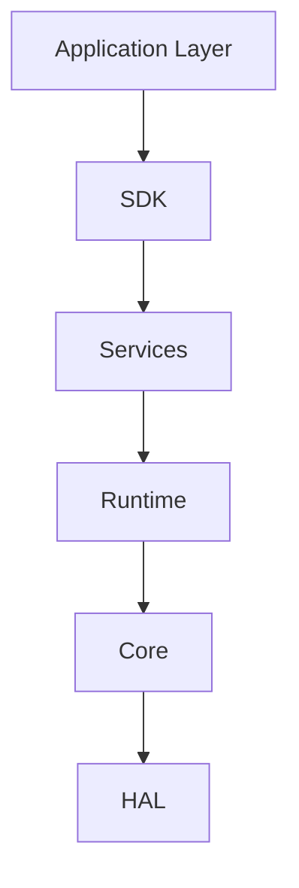

# AIoT Framework Architecture

This document provides a high-level overview of the AIoT Framework's architecture, heavily inspired by modern cloud-native systems and enterprise design patterns.

## Layered Hierarchy

The framework follows a strict dependency hierarchy to avoid circular dependencies and ensure modularity.

### 1. Application Layer (CLI, Edge Node)
Contains entrypoints and application specific orchestrators (e.g., `aiot-cli`).

### 2. SDK Layer
Language bindings and high-level abstractions for interacting with the Framework's APIs (e.g., Python SDK, Rust SDK).

### 3. Services Layer
Domain-specific modules providing rich functionality:
- `Plugins`: Dynamic module loading and sandbox execution.
- `Telemetry`: Distributed tracing, metrics, and logging.
- `Security`: RBAC, Certificate rotation, and Policy enforcement.
- `Storage`: Storage abstraction (Memory, Disk, S3).
- `Scheduler`: Priority, Round Robin, and AI-driven task scheduling.

### 4. Runtime Layer
The engine executing the workflows, handling lifecycle (`Created` -> `Initialized` -> `Running` -> `Stopped`) and injecting dependencies via a robust DI container (`ServiceRegistry`).

### 5. Core Layer
Contains all fundamental primitive types, traits, and Error taxonomies (`AiotError`, `SysId`, `CoreError`). These abstractions ensure the upper layers are not tightly coupled to specific implementations.

### 6. HAL Layer (Hardware Abstraction)
Hardware-specific APIs for interfacing with real devices (e.g., Sensors, GPUs, Edge NPUs).

## Key Patterns

1. **Trait-First Design**: Components communicate over interfaces (traits). Implementations are resolved via Dependency Injection.
2. **Builder Pattern**: Fluent API design (`configure().build()`) for all complex system components.
3. **Resilience**: `CircuitBreaker` and `RetryPolicy` built-in for storage, network, and plugin integrations.
